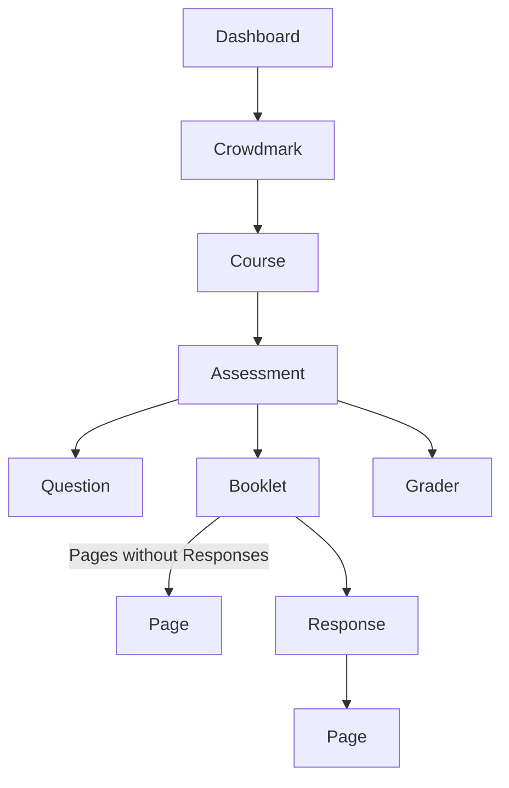

# Crowdmark Dashboard

## Instructions for Composer Package
Install this package
`composer require waterloobae/crowdmarkdashboard`

Make sure that your server environment variable for Crowdmark API is available for better security.

In Linux (.bashrc, .bash_profile, or CI/CD settings):
`export CROWDMARK_API_KEY="your-secret-key"`

For Docker (docker-compose.yml):
```
environment:
  - CROWDMARK_API_KEY=your-secret-key
```

For .env file (if using Laravel or Symfony):
`CROWDMARK_API_KEY=your-secret-key`

In your PHP file,
1. Include outoload file
   `require 'vendor/autoload.php';`
2. Define name space
   `namespace Waterloobae\CrowdmarkDashboard;`
3. Create new Dashboard object and run getForm() method.
   ```php
   use Waterloobae\CrowdmarkDashboard\Dashboard;
   $dashboard = new Dashboard('crowdmark api key');
   $dashboard->getForm()   
   ```
    
It will look like
```php
<?php
namespace Waterloobae\CrowdmarkDashboard;
if (session_status() == PHP_SESSION_NONE) {
    session_start();
}

include_once($_SERVER['DOCUMENT_ROOT'].'/vendor/autoload.php');
use Waterloobae\CrowdmarkDashboard\Dashboard;
?>
<!DOCTYPE html>
<html lang="en">
<head>
    <meta charset="UTF-8">
    <title>Crowdmark Dashboard</title>
    </head>
<body>
    <?php
        $crowdmark_api_key = "your Crowdmark API key";
        $dashboard = new Dashboard($crowdmark_api_key);
        $dashboard->getForm()
    ?></body>
</html>
```

## Features
1. Download cover pages or 2nd pages of selected courses.
2. Generate student information csv file of selected courses
3. Generate student email list csv file
4. Generate CSV file of how many questions are graded for selected courses
5. How many questions are graded for each graders are listed in CSV file
6. How many booklets are uploaded and matched are listed for selected courses.
7. It checks how many response are available for grading compared to the number of uploaded booklets to check integrity 

## Release Notes : version 1.00.0
API call rate limiting of 10 requests per second is enforced.

API call for responses is made for each booklet, that created around 2,500 API calls. As a result of that, it take around 30 minutes to create one Assessment. /api/responses/*response_id* is used for this.

Instead of using /api/questions/question_id/responses. Multi curls for /api/booklets/booklet_id/responses are used. It reduces response time from 30 minutes to 2 minutes.

## Crowdmark API Endpoints

**GET courses**  
`https://app.crowdmark.com/api/courses?api_key=your_api_key`

**GET one course**  
`https://app.crowdmark.com/api/courses/{course id}?api_key=your_api_key`

**GET assessments of one course**  
`https://app.crowdmark.com/api/courses/{course id}/assessments?api_key=your_api_key`

**GET one assessment**  
`https://app.crowdmark.com/api/assessments/{assessment id}?api_key=your_api_key`

**GET all booklets from assessment (paged)**  
`https://app.crowdmark.com/api/assessments/{assessment id}/booklets?api_key=your_api_key`

**GET one booklet**  
`https://app.crowdmark.com/api/booklets/{booklet id}?api_key=your_api_key`

**GET one booklet**  
`https://app.crowdmark.com/api/booklets/{booklet id}?api_key=your_api_key`

**GET responses from one booklet**  
`https://app.crowdmark.com/api/booklets/{booklet id}/responses?api_key=your_api_key`

**GET pages from one booklet**  
`https://app.crowdmark.com/api/booklets/{booklet id}/pages?api_key=your_api_key`

**GET scores from response**  
`https://app.crowdmark.com/api/responses/{response id}/scores?api_key=your_api_key`

**GET pages from response**  
`https://app.crowdmark.com/api/responses/{response id}/pages?api_key=your_api_key`

**GET one question**  
`https://app.crowdmark.com/api/questions/{question id}?api_key=your_api_key`

**GET the second page of booklets**  
`https://app.crowdmark.com/api/assessments/{assessment id}/booklets?page%5Bnumber%5D=2&api_key=your_api_key`

## Class Dependency


It is possible to get Responses from Question, however, it times out for big Assessments.

